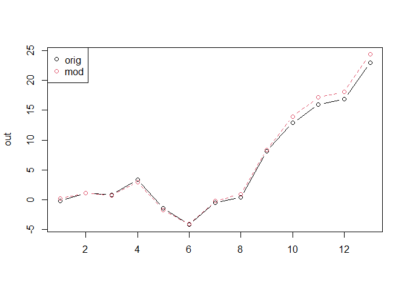

# Potential bug in the R package `Synth`

Running the first example in the docs of `Synth::synth()` (using the
“Toy panel dataset”) gives:

``` r
library(Synth)
```

    ## ##
    ## ## Synth Package: Implements Synthetic Control Methods.

    ## ## See https://web.stanford.edu/~jhain/synthpage.html for additional information.

``` r
packageVersion("Synth")
```

    ## [1] '1.1.6'

``` r
# load data
data(synth.data)

# create matrices from panel data that provide inputs for synth()
dataprep.out <-
 dataprep(
   foo = synth.data,
   predictors = c("X1", "X2", "X3"),
   predictors.op = "mean",
   dependent = "Y",
   unit.variable = "unit.num",
   time.variable = "year",
   special.predictors = list(
     list("Y", 1991, "mean"),
     list("Y", 1985, "mean"),
     list("Y", 1980, "mean")
   ),
   treatment.identifier = 7,
   controls.identifier = c(29, 2, 13, 17, 32, 38),
   time.predictors.prior = c(1984:1989),
   time.optimize.ssr = c(1984:1990),
   unit.names.variable = "name",
   time.plot = 1984:1996
 )

synth.out <- synth(dataprep.out)
```

    ## 
    ## X1, X0, Z1, Z0 all come directly from dataprep object.
    ## 
    ## 
    ## **************** 
    ##  searching for synthetic control unit  
    ##  
    ## 
    ## **************** 
    ## **************** 
    ## **************** 
    ## 
    ## MSPE (LOSS V): 4.714688 
    ## 
    ## solution.v:
    ##  0.00490263 0.003884407 0.1972011 0.2707289 0.0007091301 0.5225738 
    ## 
    ## solution.w:
    ##  0.0001407318 0.004851527 0.1697786 0.2173031 0.6079231 2.9419e-06

``` r
gaps_orig <- dataprep.out$Y1plot - (
  dataprep.out$Y0plot %*% synth.out$solution.w
)
```

Now, I change the order of the predictors to be `c("X3", "X1", "X2")`
without changing anything else:

``` r
dataprep.out <-
 dataprep(
   foo = synth.data,
   predictors = c("X3", "X1", "X2"),
   predictors.op = "mean",
   dependent = "Y",
   unit.variable = "unit.num",
   time.variable = "year",
   special.predictors = list(
     list("Y", 1991, "mean"),
     list("Y", 1985, "mean"),
     list("Y", 1980, "mean")
   ),
   treatment.identifier = 7,
   controls.identifier = c(29, 2, 13, 17, 32, 38),
   time.predictors.prior = c(1984:1989),
   time.optimize.ssr = c(1984:1990),
   unit.names.variable = "name",
   time.plot = 1984:1996
 )

synth.out <- synth(dataprep.out)
```

    ## 
    ## X1, X0, Z1, Z0 all come directly from dataprep object.
    ## 
    ## 
    ## **************** 
    ##  searching for synthetic control unit  
    ##  
    ## 
    ## **************** 
    ## **************** 
    ## **************** 
    ## 
    ## MSPE (LOSS V): 4.397736 
    ## 
    ## solution.v:
    ##  0.0001072156 0.0001754355 0.007525055 0.0002855305 0.01052174 0.981385 
    ## 
    ## solution.w:
    ##  0.01119272 0.004837565 0.04082863 0.2345055 0.6235084 0.08512721

``` r
gaps_mod <- dataprep.out$Y1plot - (
  dataprep.out$Y0plot %*% synth.out$solution.w
)
```

Comparing the two:

``` r
out <- cbind(gaps_orig, gaps_mod)
out
```

    ##               7          7
    ## 1984 -0.1686325  0.1893536
    ## 1985  1.0936597  1.1648763
    ## 1986  0.8502235  0.7300337
    ## 1987  3.3489866  2.9856265
    ## 1988 -1.4241479 -1.7695154
    ## 1989 -4.1947133 -4.0939843
    ## 1990 -0.4646250 -0.2292420
    ## 1991  0.3998366  0.9373385
    ## 1992  8.1181380  8.3290952
    ## 1993 12.8906031 13.9617721
    ## 1994 15.9712216 17.1929960
    ## 1995 16.9174715 18.0576735
    ## 1996 22.9879423 24.3488169

``` r
matplot(out, type = "b", pch = 1, col = 1:2)
legend("topleft", legend = c("orig", "mod"), col = 1:2, pch = 1)
```

<!-- -->

Not a big difference in this case, but still a difference whereas there
shouldn’t be any. It isn’t mentioned anywhere in the documentation that
the order of controls is important (and I don’t know why it should be
like that).
